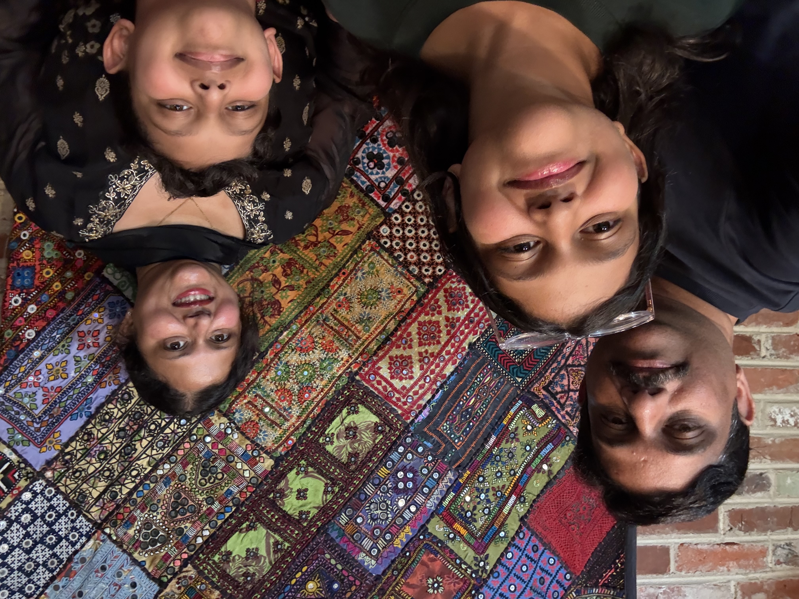
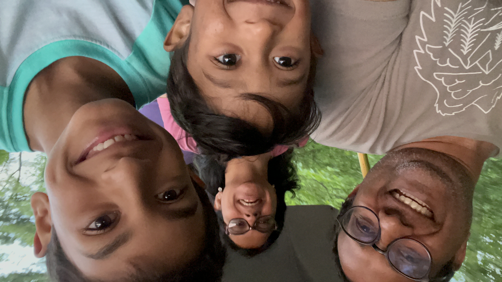
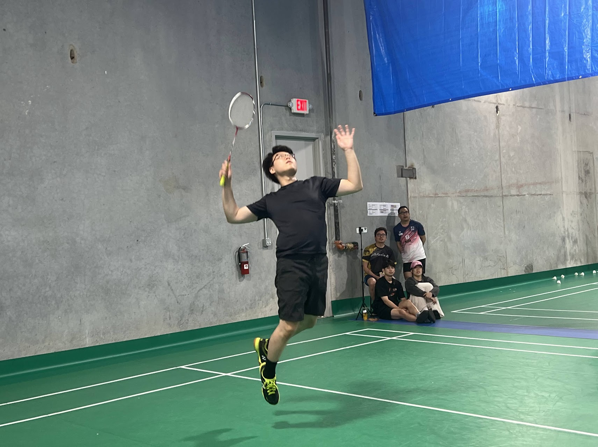
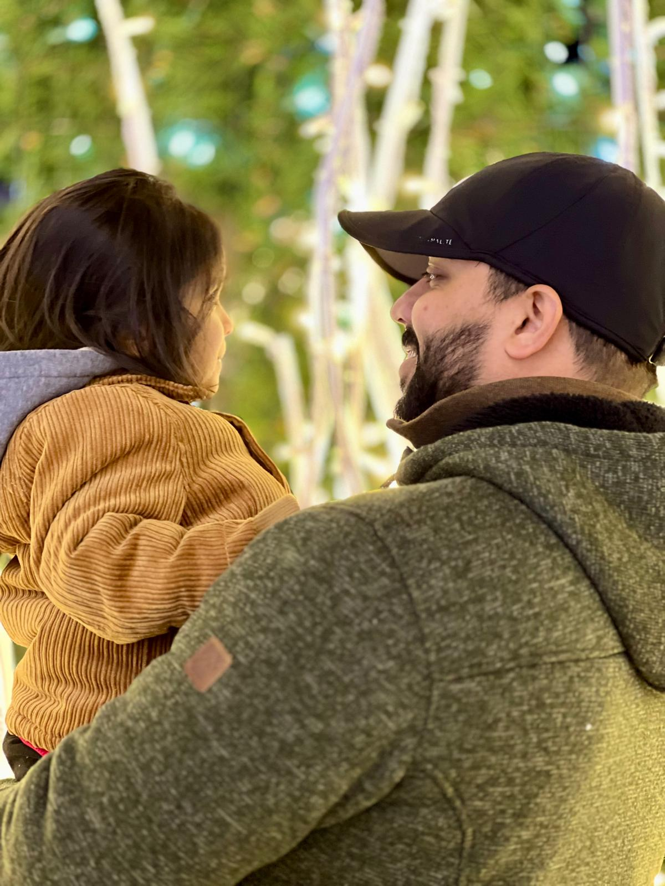
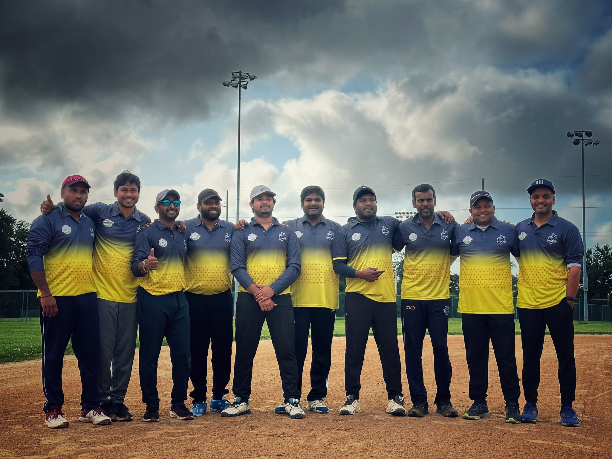

# 👨‍🎓 Student Portfolios

Welcome to the Decision Analytics Student Portfolio Collection!

This README is automatically generated and updated when changes are made to student portfolios.

## 📊 Current Students

| Student | Nickname | Interesting Facts | Portfolio | GitHub | Thumbnails |
|---------|----------|-------------------|-----------|--------|------------|
| AdamF | Adam | Inventor of "The Invisible Pool Toy" - I hold a pa...<br>I like biking in cities and on gravel rail trails.... | [View Portfolio](AdamF/README.md) | N/A |  |
| AshwiniP | Ashwini | I am a big Harry Potter fan!<br>I like to ride bike and hiking🚴 | [View Portfolio](AshwiniP/README.md) | N/A |  |
| Ayesha | Ayesha | Interested in listening to music during long drive...<br>N/A | [View Portfolio](Ayesha/README.md) | N/A |  |
| Chandra | Chandra | Data enthusiast, hobbyist artist and singer.<br>N/A | [View Portfolio](Chandra/README.md) | N/A |  |
| JayaPrakash | JP | N/A<br>N/A | [View Portfolio](JayaPrakash/README.md) | N/A |  |
| LukeB | Luke | I have a 3yo Sheepadoodle named Benny.<br>I like playing badminton in my free time. | [View Portfolio](LukeB/README.md) | N/A |  |
| MukeshM | N/A | N/A<br>N/A | [View Portfolio](MukeshM/README.md) | N/A | No images |
| RaheelU | Raheel | Enjoy traveling and hiking<br>Philadelphia sports fan - Go Birds!! | [View Portfolio](RaheelU/README.md) | N/A |  |
| RaviM | Ravi | Enjoy coding<br>Watching movies | [View Portfolio](RaviM/README.md) | N/A | No images |
| RohitT | RohitT | I value time with family, especially my daughter<br>I believe small improvements every day make a big ... | [View Portfolio](RohitT/README.md) | N/A |  |
| SidJena | Sid | My favorite band growing up was The Backstreet Boy...<br>I play a lot of sports. | [View Portfolio](SidJena/README.md) | N/A |  |
| Sobina | Sobina | You'll always find me singing when I'm driving lik...<br>I've recently got obsessed with 5Ks. | [View Portfolio](Sobina/README.md) | N/A |  |
| VicT | Venkat | <br>Traveling with Family | [View Portfolio](VicT/README.md) | N/A |  |
| VikramG | Vikram | I love running and at one point was doing half mar...<br>I like travelling and just relaxing doing nothing! | [View Portfolio](VikramG/README.md) | N/A |  |
| ashandilya48 | Anupam | I am a very bad karaoke singer<br>I am foolishly optimistic person | [View Portfolio](ashandilya48/README.md) | N/A |  |
| mrbabu | Rohit M | sports entusiast, teetotaler and intovert<br>One of the best cricket player in DE | [View Portfolio](mrbabu/README.md) | N/A |  |

## 🆕 How to Add Your Portfolio

1. Create a new folder with your name (e.g., `YourName`)
2. Add a `README.md` file with your information following this format:

```markdown
# 👨‍🎓 Student Portfolio - Your Name

---

## 📋 Student Information

| **Field** | **Details** |
|-----------|-------------|
| **Nickname/Pseudonym** | Your Nickname |
| **Interesting Fact** | An interesting fact about you |
| **Interesting Fact2** | Another interesting fact about you |

---

## 🖼️ Portfolio Images

### Image Title

```

3. Include portfolio images in your folder
4. Commit and push your changes

## 🔄 Auto-Generation

This README is automatically updated via GitHub Actions whenever any `README.md` file in the student-portfolios folder (or its subfolders) is modified.

---
*Last updated: %Y->- (HEAD -> main, origin/main) 0b6455a54bfbf11684c79814a4fccb0bd18a3d24:%M:HEAD*
